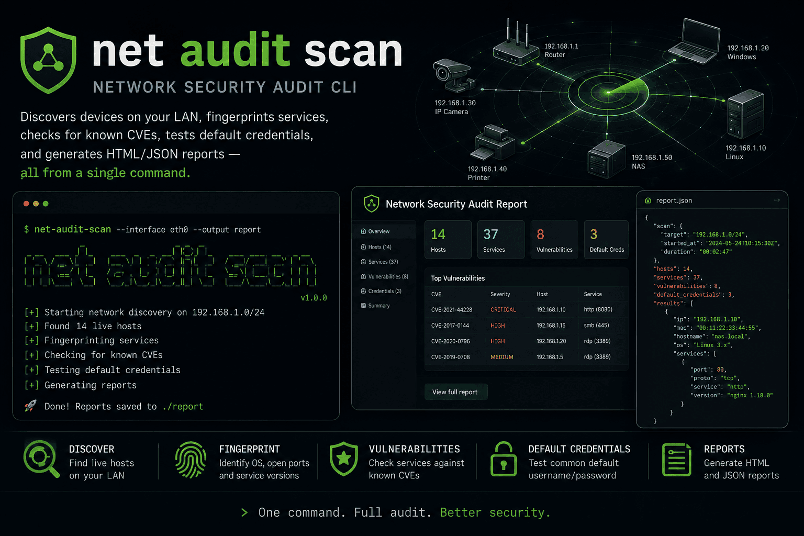

# netascan



Net Audit Scanner. Discovers devices on your LAN, fingerprints services, enriches with SNMP/mDNS/vendor data, checks for known CVEs, tests default credentials, and generates HTML/JSON reports — all from a single command.

**[Documentation](https://jorgealonsodev.github.io/net-audit-scanner)**

```
netascan scan --network 192.168.1.0/24
```

---

## Installation

### Pre-built binaries (recommended)

Download the latest release from the [Releases page](https://github.com/jorgealonsodev/net-audit-scanner/releases).

**Linux (tar.gz)**

```bash
tar -xzf netascan-v0.2.0-x86_64-unknown-linux-gnu.tar.gz
sudo mv netascan /usr/local/bin/
```

**macOS (tar.gz)**

```bash
tar -xzf netascan-v0.2.0-aarch64-apple-darwin.tar.gz
sudo mv netascan /usr/local/bin/
```

### Debian / Ubuntu (.deb)

```bash
wget https://github.com/jorgealonsodev/net-audit-scanner/releases/latest/download/netascan-v0.2.0-amd64.deb
sudo dpkg -i netascan-v0.2.0-amd64.deb
```

### Build from source

Requires Rust stable (`rustup update stable`) and `libpcap-dev` on Linux.

```bash
# Linux
sudo apt-get install -y libpcap-dev

# Build
cargo build --release
sudo mv target/release/netascan /usr/local/bin/
```

---

## Quick start

```bash
# Scan your local network (auto-detects interface)
sudo netascan scan

# Scan a specific range and open an HTML report
sudo netascan scan --network 192.168.1.0/24 --report html

# View the most recent scan as a report
netascan report --last

# Start the web dashboard (upload + browse reports)
netascan serve
```

> **Requires root / CAP_NET_RAW** for ICMP sweep. Without it, netascan falls back to TCP + ARP discovery.

> **API keys under sudo:** use `sudo -E netascan scan` to preserve your `NVD_API_KEY` environment variable.

---

## Commands

### `scan`

Discover hosts, scan ports, enrich with SNMP/mDNS/vendor data and CVEs, test default credentials, and output results.

| Flag | Default | Description |
|------|---------|-------------|
| `--network` / `-n` | `auto` | CIDR range or `auto` to detect from the active interface |
| `--target` | — | Single IP for in-depth scan |
| `--port-range` | `top-1000` | Port set: `top-1000`, `full` (1–65535), or a custom range |
| `--full` | off | Equivalent to `--port-range full` |
| `--concurrency` | 512 | Max parallel connections |
| `--timeout-ms` | 1500 | TCP connect timeout (ms) |
| `--banner-timeout-ms` | 500 | Banner grab timeout (ms) |
| `--report` / `-r` | `html` | Output format: `html` or `json` (file) plus table to stdout |
| `--json` | off | Print JSON to stdout instead of table |
| `--no-cve` | off | Skip CVE enrichment |
| `--no-update` | off | Use embedded OUI database instead of cached |
| `--no-mac-api` | off | Disable MacVendors API lookup (enabled by default, no key needed) |

### `report`

Generate or view a report from a saved scan.

```bash
netascan report --last              # most recent scan
netascan report --format html       # html (default) or json
```

### `serve`

Local web dashboard on `http://localhost:3000`. Upload a scan JSON and browse the HTML report in-browser.

```bash
netascan serve
netascan serve --port 8080
```

### `update`

Refresh the OUI (vendor) database used for MAC fingerprinting.

```bash
netascan update
netascan update --source https://your-mirror.example.com/manuf
```

---

## What a scan does

```
[1/5] discover hosts (ICMP + ARP + TCP)
        ↓
[2/5] scan ports (top-1000 by default) + grab banners → infer OS hint
        ↓
[3/5] enrich devices:
        • OUI vendor lookup (embedded Wireshark database)
        • SNMP v2c (sysDescr + sysName via raw UDP)
        • mDNS (hostname + device model via mdns-sd)
        • MacVendors API (vendor fallback, 1 req/s, no key needed)
        ↓
[4/5] CVE enrichment (NVD API, cached in ~/.cache/netascan/cve.db)
        ↓
[5/5] test default credentials (HTTP Basic, FTP, Telnet — SecLists ~2800 pairs, auto-downloaded)
        ↓
      persist to ~/.cache/netascan/scans/
        ↓
      output (table / JSON / HTML report)
```

---

## Configuration

Config file: `~/.netascan/config.toml` (created with defaults on first run).

On the first `netascan scan`, missing optional keys are prompted interactively — press Enter to skip any.

```toml
[scan]
default_network    = "auto"
port_range         = "top-1000"
timeout_ms         = 1500
banner_timeout_ms  = 500
concurrency        = 512

[cve]
nvd_api_key        = ""          # optional — raises NVD rate limit from 5 to 50 req/30s
                                 # get one free at https://nvd.nist.gov/developers/request-an-api-key
cache_ttl_hours    = 24

[report]
default_format     = "html"
open_browser       = false

[credentials_check]
enabled            = true
custom_list        = ""          # path to a custom credentials file
                                 # default db: SecLists ~2800 pairs, auto-downloaded to
                                 # ~/.cache/netascan/default-creds.csv on first scan

[enrichment]
snmp_enabled       = true
mdns_enabled       = true
mac_api_enabled    = true        # MacVendors API — free, no key needed up to 1000 req/day
mac_vendors_api_key = ""         # optional — only for paid plan higher limits
snmp_community     = "public"
snmp_timeout_ms    = 1000
mdns_timeout_ms    = 2000
```

### Environment variables

| Variable | Description |
|----------|-------------|
| `NVD_API_KEY` | NVD API key (overrides config). Use `sudo -E` to preserve under sudo. |
| `MAC_VENDORS_API_KEY` | MacVendors paid plan key (optional). |
| `RUST_LOG` | Log verbosity (e.g. `RUST_LOG=debug`). Silent by default. |

---

## Scan persistence

Every scan is saved as JSON under `~/.cache/netascan/scans/`. Up to 10 timestamped files are kept; older ones are pruned automatically. Use `report --last` to load the most recent one without re-scanning.

---

## Requirements

| Requirement | Notes |
|-------------|-------|
| Rust 2024 edition | `rustup update stable` |
| Root / CAP_NET_RAW | ICMP sweep only. TCP+ARP fallback works without. |
| `libpcap-dev` | Linux only (`sudo apt-get install libpcap-dev`) |
| Internet access | CVE enrichment via NVD API (optional, skippable with `--no-cve`) |

---

## Development

```bash
cargo test                  # run all tests
cargo clippy --all-targets  # lint
cargo bench                 # benchmarks (criterion)
```

Tests that require network access are marked `#[ignore]` and skipped by default.

---

## License

MIT
